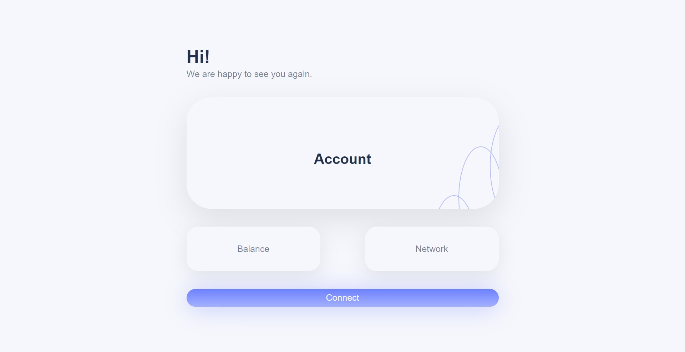
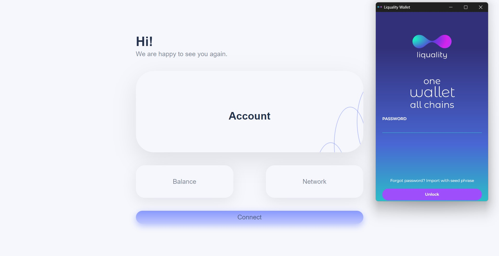
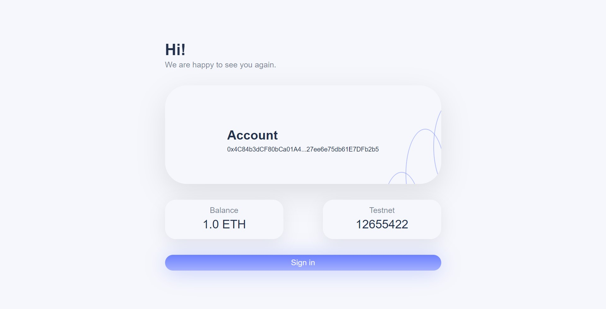

# Web3 react dapp 🔥🔥🔥

Web3 react dapp is a [Next.js](https://nextjs.org/) project 



With Web3 you can connect to your wallet we used [liquality.io](https://liquality.io/)



And !!! get YOUR information {Account, Balance, Network}



I use [Figma](https://www.figma.com/) as a designing tool so for a better view [Click Here](https://www.figma.com/proto/ys912Kj5YNZa1Lf1GCNhnL/Web3-react-dapp?page-id=0%3A1&node-id=31%3A116&starting-point-node-id=31%3A116)

## Setup the environment

run the development server:

```bash
npm run dev
# or
yarn dev
```
Open [http://localhost:3000](http://localhost:3000) with your browser to see the result.

You can start editing the page each component `Components`. The page auto-updates as you edit the files.

## Learn More

You want to learn Next.js?! 


Traversy Media Youtube chanel have a pretty cool crash course to introduce you to Next.js [Click Here](https://www.youtube.com/watch?v=mTz0GXj8NN0&t=1214s)

Also take a look at the following resources:
- [Next.js Documentation](https://nextjs.org/docs) - learn about Next.js features and API.
- [Learn Next.js](https://nextjs.org/learn) - an interactive Next.js tutorial.
